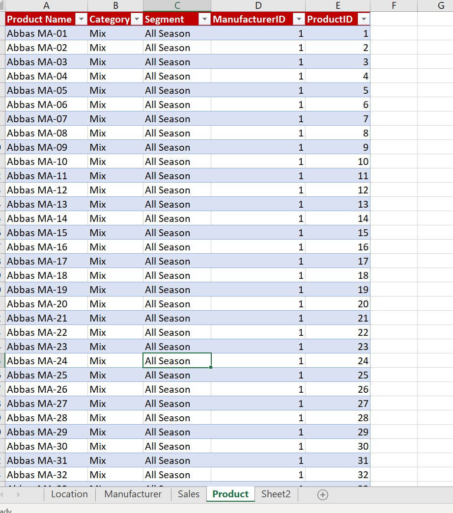
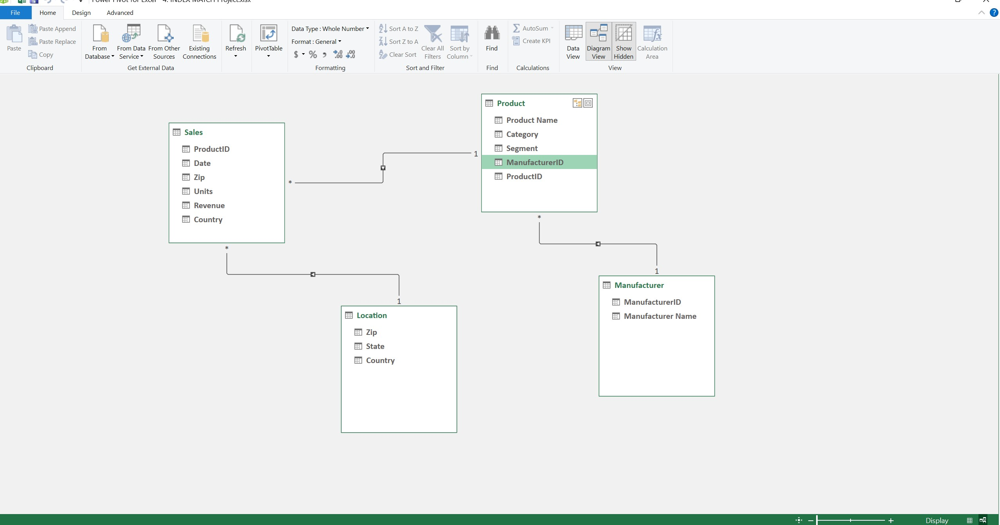
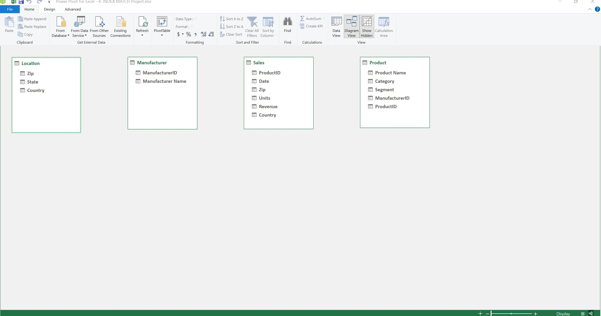

# Wixsin Company Revenue Analysis

## Introduction
The goal of this project is to analyze sales data in order to find trends, patterns, and KPIs that can be used to inform business decisions. An interactive Excel dashboard presents and visualizes the analysis results for simple exploration and comprehension.

**_Disclaimer_**: _All datasets and reports are fictitious and are intended only to show off Microsoft Excel's capabilities. They do not represent any organization, nation, or enterprise._

## Problem Statement
1. Is revenue growing on a monthly basis?
2. What days of the week does the company make the most revenue?
3. What is the proportion of category to total revenue?
4. What is the contribution of each state to the total revenue of the company?
5. What segment has the highest amount of revenue?
6. What are the top 5 selling products?

## Skills Demonstrated
The Following Microsoft Excel features were incorporated:
- Data Cleaning
- Data Consolidation with Index match
- Data Modelling with Power Pivot
- Pivot
- Visualisation chats
- Slicer

## Data Sourcing 
This revenue dataset was generated online and saved as a CSV file. The four sheets that make up the dataset are titled Location, Manufacturer, Sales, and Products. contains details on sales transactions, including dates, goods, amounts, costs, and client information. To do insightful analysis, one must be aware of the dataset's structure.

## Data Transaformation 
After loading the dataset into Ms. Excel, the dataset was inspected. In order to utilize Pivot, the Excel spreadsheet's four separate spreadsheets or tables have to be combined into a single table using Index Match. A table named sales_table was created from the spreadsheet's structure. Certain columns, like Month and Week, which I developed but extracted from the Date column, were not included in the spreadsheet. 
The dataset comprises 1412 rows and 14 columns, with a total revenue of $9,826,183 and 1430 total units.

Nevertheless, adopting Power Pivot—which eliminates the requirement for data consolidation—was also significantly faster. I was able to jump right into pivot and analysis using Power Pivot and data modeling. 

   Original Data                                 |    Consolidated Data 
:----------------------------------------------:|:---------------------------------------------:
                            |

## Data Modellining
No relationship was derive automatically so i had to create relationship Automatically 

 Adjusted model                                 |    Auto-model 
:----------------------------------------------:|:---------------------------------------------:
                                           |

The model is a star schema.
There are 4 dimension tables.

## Visualzation
The report comprises of one page

### WixSin Company Revenue Interactive Dashboard

_You can interact with the report [here]()_

Features

In order to make the visualization dynamic and allow users to filter and drill down to certain State, Segment, Category, Month and Days of the Week filter have been added to the report's right side.

## Analysis
-	This evaluation includes sales data from 2020 to 2021.
-	During the review period, Adidas US operated in 52 US cities, 50 states, and 5 regions.
-	Adidas US has six retailers.
-	There are 6 products

## The Report

Findings
-   In-store sales are Adidas' best-selling strategy in the US, accounting for 40% of total sales between 2020 and 2021. 
-   With the highest total sales of $242,964,333 throughout the two years under evaluation, West Gear is the best retailer.
-   During the two years under review, New York had the highest total sales of $64,229,039 among the states.
-   The sales trend from 2020 to 2021 indicates a notable increase in sales in 2021, with a notable surge in online sales in the southeast and south-central regions.

Suggestions / Recommendations 
-   When it comes to online sales, other regions will be encourage to adopt the South and Southeast's strategy in order to boost online sales there as well.
-   To boost online sales, invest in focused digital marketing initiatives, upgrade the online sales platform, and improve user experience.
-   To improve marketing messaging and product offerings, track key performance metrics, gather customer insights, and continuously monitor sales performance.
